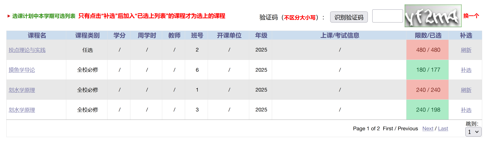

# PKUElectiveHelper

## 主要功能

1. 过滤选课列表，只显示想抢的目标课程，提高专注度

2. 实时高亮课程名额状态，若点击一门课程对应的“刷新”后发现有空余名额，名额状态会自动由红色变为绿色以提醒用户

3. 支持一键识别验证码
   
**该脚本不是刷课机，不提供自动刷课相关的任何功能！但还是请自行衡量，谨慎使用。**

## 使用教程（Tampermonkey）

1. 在浏览器中安装 [Tampermonkey](https://www.tampermonkey.net) 扩展
   
   * Tampermonkey 在 Chrome / Firefox / Microsoft Edge 中是免费的，但在 App Store 中需要付费，如果您使用的浏览器是 Safari，可以尝试使用其他脚本管理器。
   
   * Tampermonkey 安装教程：打开 [Tampermonkey](https://www.tampermonkey.net) 主页，点击您使用的浏览器名称所在标签，下拉到“下载”一栏，然后点击“Tampermonkey”所对应的“去商店”按钮，点击安装即可。
  
2. 如果您使用的是 Chrome 或其衍生浏览器，您需要 **启用开发者模式**，详情请见 [如何启用开发者模式](https://www.tampermonkey.net/faq.php#Q209)

3. 打开 [PKU 手动抢课小助手](https://greasyfork.org/zh-CN/scripts/527300-pku-%E6%89%8B%E5%8A%A8%E6%8A%A2%E8%AF%BE%E5%B0%8F%E5%8A%A9%E6%89%8B) 并点击“安装此脚本”
   
   * 如果您无法打开该网页，也可以在 Tampermonkey 管理面板中点击“已安装脚本”旁边的加号，将本仓库内 `release.js` 中的代码全部粘贴进去并保存

4. 在浏览器右上方找到并点击 Tampermonkey 图标（可能在“扩展”的拼图图标中），打开其管理面板，启用该脚本
   
   

5. 点击该脚本名称（或“操作”中的“编辑”），进入编辑器，按照代码中的要求与格式 **填写或修改 4 项配置**，完成后请按 `ctrl + S` 或点击“文件”中的“保存”以保存修改
   
   * 其中 `allowedCourses` 和 `recognizerConfig` 必须重新填写，原来的代码仅作为示例

   * 注意使用英文半角的逗号、冒号、引号等
   
   * 该脚本使用 [TT识图](http://www.ttshitu.com) 来识别验证码，注册并登录后在账户中充值 1 元即可，识图为 0.002 元/次
   
6. 打开 PKU 选课网的“补退选”页面，就能看到脚本已经生效啦（如果希望停用该脚本，在 Tampermonkey 中关闭启用该脚本即可）
   
   

## 注意事项

* 脚本内需要对识图网站进行跨域请求，浏览器可能会要求您给予相应权限，如果拒绝授权将导致识别验证码功能不可用，但其他功能仍然可用。如果希望恢复该功能，可以尝试在 Tampermonkey 扩展中点进该脚本的编辑器，切换到“设置”，删除“用户排除”和“用户域名黑名单”中的所有项。

* 有时选课列表可能会多出一些行，我暂时也不知道为什么，可以尝试刷新整个页面以恢复。
